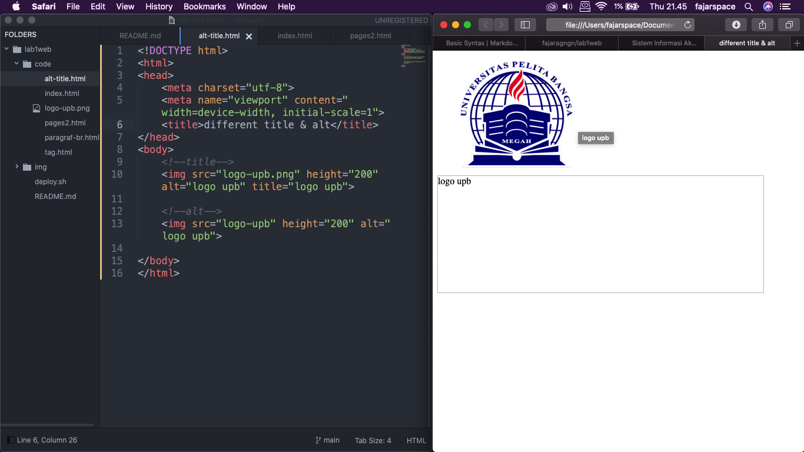

## Jawab Pertanyaan Berikut
1. Lakukan perubahan pada kode sesuai dengan keinginan anda, amati perubahannya adakah
error ketika terjadi kesalahan penulisan tag?
2. Apa perbedaan dari tag `
` dengan tag ` `, berikan penjelasannya! 
3. Apa perbedaan atribut title dan alt pada tag ``, berikan penjelasannya!
4. Untuk mengatur ukuran gambar, digunakan atribut width dan height. Agar tampilan gambar
proporsional sebaiknya kedua atribut tersebut diisi semua atau tidak? Berikan penjelasannya!
5. Pada link tambahkan atribut target dengan nilai atribut bervariasi ( _blank, _self, _top,
_parent ), apa yang terjadi pada masing-masing nilai antribut tersebut?

## Jawab
1. Saya akan melakukan perubahan pada tag html, gambar dibawah merupakan syntax HTML sebelum saya rubah

Lalu ketika saya hilangkan akhiran pada Tag `</h1>`menjadi `<h1>`, maka yang akan terjadi seluruh elemen dibawah tag tersebut akan berubah mengikuti Tag `<h1>` dikarenakan tidak ada akhiran/penutup Tag tersebut. 
Seperti gambar dibawah

2. Tag `
`
Tag ini berfungsi untuk memberi perintah paragraf pada halaman html, antara baris atau paragraf terbentuk jarak.

	Tag ` ` berfungsi untuk memberikan perintah breakline atau baris baru.

3. `title` berfungsi untuk memberikan judul pada gambar

	`alt` berfungsi untuk menunjukkan sebuah alternate text (teks pengganti) yang akan muncul apabila gambar tidak dapat ditampilkan.
	gambar dibawah ini menunjukan perbedaan title dan alt
